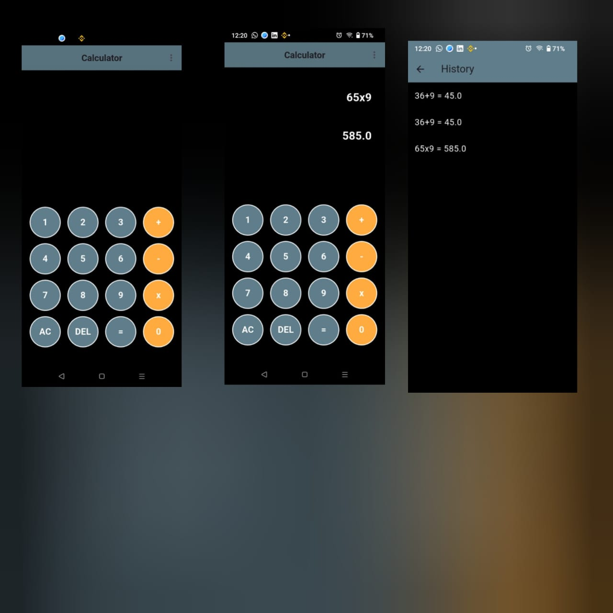

# 🧮 Calculator App

A Flutter-based calculator application with a clean and user-friendly interface.  
Unlike a basic calculator, this app includes a **history feature** that allows users to keep track of past calculations easily.

---

## 🚀 Features
- ➕ Perform basic arithmetic operations (Add, Subtract, Multiply, Divide).  
- 📝 **History Tracking** – View and manage your previous calculations.  
- 📱 **Simple & Clean UI** – Easy-to-use design for smooth experience.  
- ⚡ Fast and lightweight performance.  

---

## 🛠️ Tech Stack
- **Flutter** (Dart)  
- **State Management**: setState 

---

## 📸 Screenshot



---

## 📂 Getting Started

### Installation
```bash
# Clone this repository
git clone https://github.com/your-username/calculator_app.git